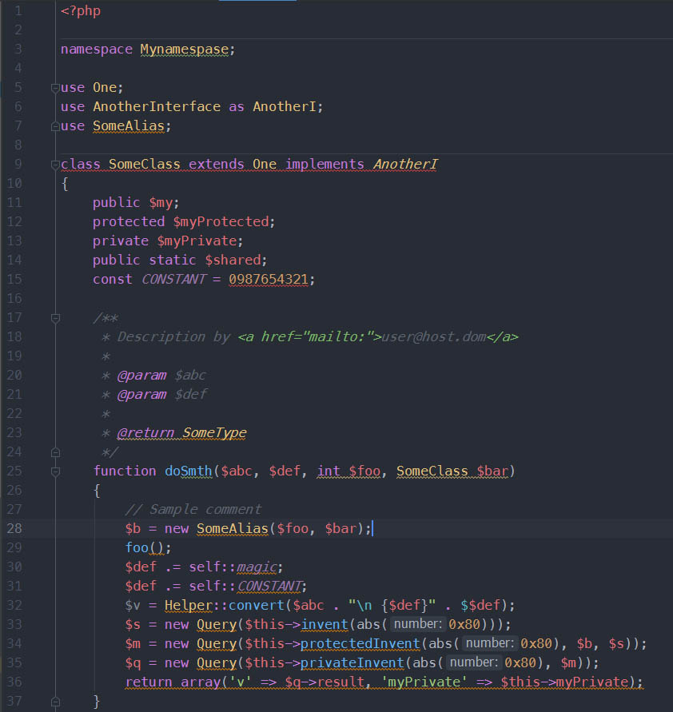

# One Dark Atom color theme for Jetbrains PhpStorm

Screenshots
---------

Installation
---------

1. Install the plugin [One Dark theme](https://one-dark.gitbook.io/jetbrains/the-basics/installation)
  - Go to Preferences | Plugins | Marketplace and search for One Dark theme
  - Install the plugin
  - When prompted, restart your IDE
  - Go to Preferences | Appearance & Behavior | Appearance and select one of the new themes in the theme dropdown.

2.  Copy `One Dark Atom.icls` to your PhpStorm preferences:
  - On Linux it is in  `/home/<username>/.WebIde<version>0/config/colors`.
  - On Mac it is in `~/Library/Preferences/WebIde<version>0/colors`.
  - On Windows it is in `C:\Users\<username>\.WebIde<version>0\config\colors`.

3. Restart PhpStorm

4. Go to `Preferences | Editor | Colors & Fonts` and select One Dark.
